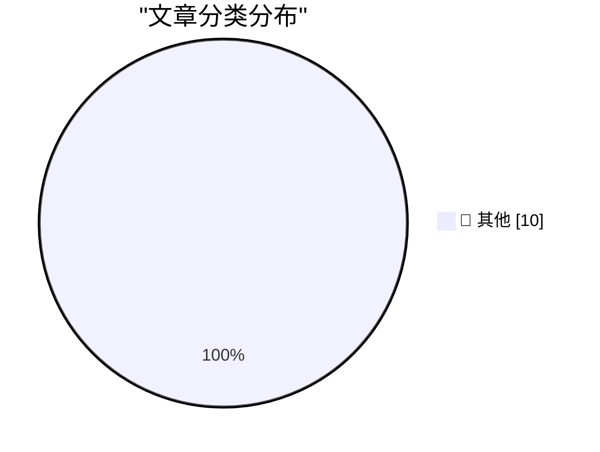

# 📰 AI 博客每日精选 — 2026-02-17

> 来自 Karpathy 推荐的 92 个顶级技术博客，AI 精选 Top 10

## 🏆 今日必读

🥇 **Quoting Dimitris Papailiopoulos**

[Quoting Dimitris Papailiopoulos](https://simonwillison.net/2026/Feb/17/dimitris-papailiopoulos/#atom-everything) — simonwillison.net · 4 分钟前 · 📝 其他

> Quoting Dimitris Papailiopoulos

🥈 **Nano Banana Pro diff to webcomic**

[Nano Banana Pro diff to webcomic](https://simonwillison.net/2026/Feb/17/release-notes-webcomic/#atom-everything) — simonwillison.net · 9 小时前 · 📝 其他

> Nano Banana Pro diff to webcomic

🥉 **Qwen3.5: Towards Native Multimodal Agents**

[Qwen3.5: Towards Native Multimodal Agents](https://simonwillison.net/2026/Feb/17/qwen35/#atom-everything) — simonwillison.net · 9 小时前 · 📝 其他

> Qwen3.5: Towards Native Multimodal Agents

---

## 📊 数据概览

| 扫描源 | 抓取文章 | 时间范围 | 精选 |
|:---:|:---:|:---:|:---:|
| 89/92 | 2499 篇 → 18 篇 | 24h | **10 篇** |

### 分类分布

---

## 📝 其他

### 1. Quoting Dimitris Papailiopoulos

[Quoting Dimitris Papailiopoulos](https://simonwillison.net/2026/Feb/17/dimitris-papailiopoulos/#atom-everything) — **simonwillison.net** · 4 分钟前 · ⭐ 15/30

> Quoting Dimitris Papailiopoulos

---

### 2. Nano Banana Pro diff to webcomic

[Nano Banana Pro diff to webcomic](https://simonwillison.net/2026/Feb/17/release-notes-webcomic/#atom-everything) — **simonwillison.net** · 9 小时前 · ⭐ 15/30

> Nano Banana Pro diff to webcomic

---

### 3. Qwen3.5: Towards Native Multimodal Agents

[Qwen3.5: Towards Native Multimodal Agents](https://simonwillison.net/2026/Feb/17/qwen35/#atom-everything) — **simonwillison.net** · 9 小时前 · ⭐ 15/30

> Qwen3.5: Towards Native Multimodal Agents

---

### 4. Two new Showboat tools: Chartroom and datasette-showboat

[Two new Showboat tools: Chartroom and datasette-showboat](https://simonwillison.net/2026/Feb/17/chartroom-and-datasette-showboat/#atom-everything) — **simonwillison.net** · 13 小时前 · ⭐ 15/30

> Two new Showboat tools: Chartroom and datasette-showboat

---

### 5. Rodney and Claude Code for Desktop

[Rodney and Claude Code for Desktop](https://simonwillison.net/2026/Feb/16/rodney-claude-code/#atom-everything) — **simonwillison.net** · 21 小时前 · ⭐ 15/30

> Rodney and Claude Code for Desktop

---

### 6. AI is destroying Open Source, and it's not even good yet

[AI is destroying Open Source, and it's not even good yet](https://www.jeffgeerling.com/blog/2026/ai-is-destroying-open-source/) — **jeffgeerling.com** · 16 小时前 · ⭐ 15/30

> AI is destroying Open Source, and it's not even good yet

---

### 7. LLM-generated skills work, if you generate them afterwards

[LLM-generated skills work, if you generate them afterwards](https://seangoedecke.com/generate-skills-afterwards/) — **seangoedecke.com** · 14 小时前 · ⭐ 15/30

> LLM-generated skills work, if you generate them afterwards

---

### 8. [Sponsor] Hands-On Workshop: Fix It Faster — Crash Reporting, Tracing, and Logs for iOS in Sentry

[[Sponsor] Hands-On Workshop: Fix It Faster — Crash Reporting, Tracing, and Logs for iOS in Sentry](https://sentry.io/resources/ios-workshop-jan-2026/?utm_source=daringfireball&amp;utm_medium=paid-display&amp;utm_campaign=general-fy27q1-evergreen&amp;utm_content=static-ad-mobilerss-trysentry) — **daringfireball.net** · 14 小时前 · ⭐ 15/30

> [Sponsor] Hands-On Workshop: Fix It Faster — Crash Reporting, Tracing, and Logs for iOS in Sentry

---

### 9. Pluralistic: What's a "gig work minimum wage" (17 Feb 2026)

[Pluralistic: What's a "gig work minimum wage" (17 Feb 2026)](https://pluralistic.net/2026/02/17/no-piecework/) — **pluralistic.net** · 3 小时前 · ⭐ 15/30

> Pluralistic: What's a "gig work minimum wage" (17 Feb 2026)

---

### 10. Gadget Review: Epomaker Split 70 Mechanical Keyboard ★★★★⯪

[Gadget Review: Epomaker Split 70 Mechanical Keyboard ★★★★⯪](https://shkspr.mobi/blog/2026/02/gadget-review-epomaker-split-70-mechanical-keyboard/) — **shkspr.mobi** · 1 小时前 · ⭐ 15/30

> Gadget Review: Epomaker Split 70 Mechanical Keyboard ★★★★⯪

---

*生成于 2026-02-17 14:09 | 扫描 89 源 → 获取 2499 篇 → 精选 10 篇*
*基于 [Hacker News Popularity Contest 2025](https://refactoringenglish.com/tools/hn-popularity/) RSS 源列表，由 [Andrej Karpathy](https://x.com/karpathy) 推荐*
*由「懂点儿AI」制作，欢迎关注同名微信公众号获取更多 AI 实用技巧 💡*
