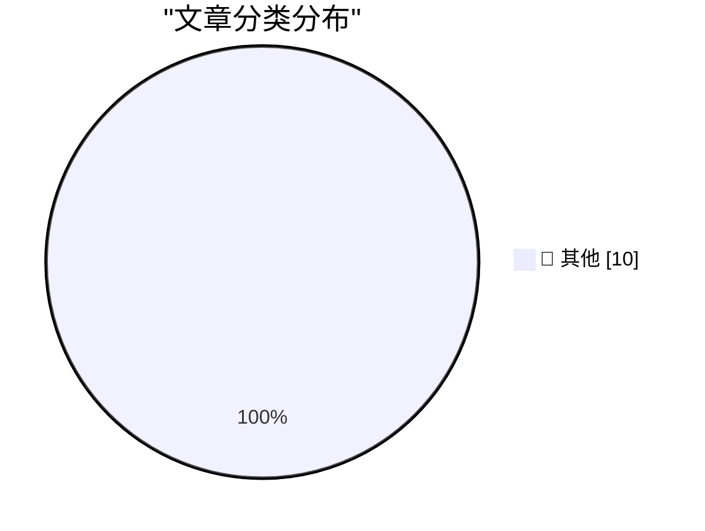

# 📰 AI 博客每日精选 — 2026-02-18

> 来自 Karpathy 推荐的 92 个顶级技术博客，AI 精选 Top 10

## 🏆 今日必读

🥇 **Introducing Claude Sonnet 4.6**

[Introducing Claude Sonnet 4.6](https://simonwillison.net/2026/Feb/17/claude-sonnet-46/#atom-everything) — simonwillison.net · 14 小时前 · 📝 其他

> Introducing Claude Sonnet 4.6

🥈 **Rodney v0.4.0**

[Rodney v0.4.0](https://simonwillison.net/2026/Feb/17/rodney/#atom-everything) — simonwillison.net · 15 小时前 · 📝 其他

> Rodney v0.4.0

🥉 **Quoting ROUGH DRAFT 8/2/66**

[Quoting ROUGH DRAFT 8/2/66](https://simonwillison.net/2026/Feb/17/rough-draft-8266/#atom-everything) — simonwillison.net · 23 小时前 · 📝 其他

> Quoting ROUGH DRAFT 8/2/66

---

## 📊 数据概览

| 扫描源 | 抓取文章 | 时间范围 | 精选 |
|:---:|:---:|:---:|:---:|
| 89/92 | 2501 篇 → 17 篇 | 24h | **10 篇** |

### 分类分布

---

## 📝 其他

### 1. Introducing Claude Sonnet 4.6

[Introducing Claude Sonnet 4.6](https://simonwillison.net/2026/Feb/17/claude-sonnet-46/#atom-everything) — **simonwillison.net** · 14 小时前 · ⭐ 15/30

> Introducing Claude Sonnet 4.6

---

### 2. Rodney v0.4.0

[Rodney v0.4.0](https://simonwillison.net/2026/Feb/17/rodney/#atom-everything) — **simonwillison.net** · 15 小时前 · ⭐ 15/30

> Rodney v0.4.0

---

### 3. Quoting ROUGH DRAFT 8/2/66

[Quoting ROUGH DRAFT 8/2/66](https://simonwillison.net/2026/Feb/17/rough-draft-8266/#atom-everything) — **simonwillison.net** · 23 小时前 · ⭐ 15/30

> Quoting ROUGH DRAFT 8/2/66

---

### 4. Apple Invites Media to Special ‘Experience’ in New York, London, and Shanghai on March 4

[Apple Invites Media to Special ‘Experience’ in New York, London, and Shanghai on March 4](https://www.macrumors.com/2026/02/16/apple-announces-special-event-in-new-york/) — **daringfireball.net** · 14 小时前 · ⭐ 15/30

> Apple Invites Media to Special ‘Experience’ in New York, London, and Shanghai on March 4

---

### 5. ★ Apple Releases iOS 26 Adoption Rates, and They’re Pretty Much in Line With the Last Few Years

[★ Apple Releases iOS 26 Adoption Rates, and They’re Pretty Much in Line With the Last Few Years](https://daringfireball.net/2026/02/apple_releases_ios_26_adoption_rates) — **daringfireball.net** · 19 小时前 · ⭐ 15/30

> ★ Apple Releases iOS 26 Adoption Rates, and They’re Pretty Much in Line With the Last Few Years

---

### 6. How to Force Restart an iPhone

[How to Force Restart an iPhone](https://support.apple.com/guide/iphone/force-restart-iphone-iph8903c3ee6/ios) — **daringfireball.net** · 21 小时前 · ⭐ 15/30

> How to Force Restart an iPhone

---

### 7. Taking Our Minds for Granted

[Taking Our Minds for Granted](https://idiallo.com/blog/taking-our-mind-for-granted?src=feed) — **idiallo.com** · 2 小时前 · ⭐ 15/30

> Taking Our Minds for Granted

---

### 8. Book Review: All Systems Red - The Murderbot Diaries by Martha Wells ★★⯪☆☆

[Book Review: All Systems Red - The Murderbot Diaries by Martha Wells ★★⯪☆☆](https://shkspr.mobi/blog/2026/02/book-review-all-systems-red-the-murderbot-diaries-by-martha-wells/) — **shkspr.mobi** · 1 小时前 · ⭐ 15/30

> Book Review: All Systems Red - The Murderbot Diaries by Martha Wells ★★⯪☆☆

---

### 9. Microspeak: Escrow

[Microspeak: Escrow](https://devblogs.microsoft.com/oldnewthing/20260217-00/?p=112067) — **devblogs.microsoft.com/oldnewthing** · 23 小时前 · ⭐ 15/30

> Microspeak: Escrow

---

### 10. Rumors of AGI’s arrival have been greatly exaggerated

[Rumors of AGI’s arrival have been greatly exaggerated](https://garymarcus.substack.com/p/rumors-of-agis-arrival-have-been) — **garymarcus.substack.com** · 22 小时前 · ⭐ 15/30

> Rumors of AGI’s arrival have been greatly exaggerated

---

*生成于 2026-02-18 14:32 | 扫描 89 源 → 获取 2501 篇 → 精选 10 篇*
*基于 [Hacker News Popularity Contest 2025](https://refactoringenglish.com/tools/hn-popularity/) RSS 源列表，由 [Andrej Karpathy](https://x.com/karpathy) 推荐*
*由「懂点儿AI」制作，欢迎关注同名微信公众号获取更多 AI 实用技巧 💡*
